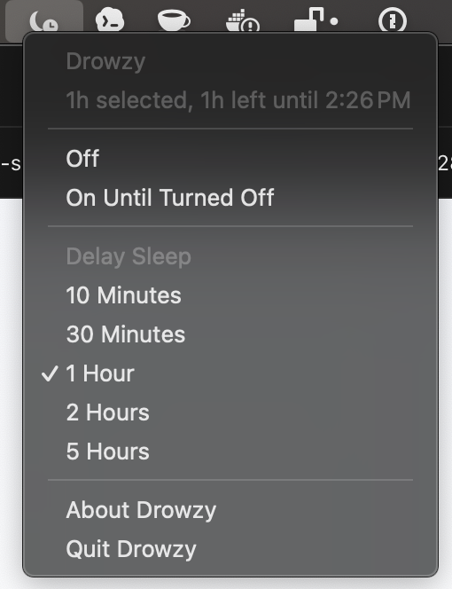

# Drowzy

Drowzy is a small macOS menu bar app for preventing idle system sleep indefinitely or for a selected short duration. Click the menu bar icon, choose `On Until Turned Off`, or delay idle sleep for `10 Minutes`, `30 Minutes`, `1 Hour`, `2 Hours`, or `5 Hours`.

The app uses a macOS IOKit `PreventUserIdleSystemSleep` assertion. It does not install a helper, run a daemon, collect analytics, or send network traffic.



## Quick Start

For normal use, download the latest `Drowzy-*-macos.zip` from [GitHub Releases](https://github.com/at1as/drowzy/releases), unzip it, and move `Drowzy.app` to `/Applications`.

Then launch the installed app:

```sh
open /Applications/Drowzy.app
```

Packaged releases do not require Xcode.

Drowzy runs as a menu bar app, so it does not show a Dock icon. Look for the Drowzy icon in the macOS menu bar.

## Motivation

Local tasks such as long-running builds, downloads, renders, or coding agents often need a few more minutes to finish. The usual choices are too blunt: let the Mac sleep and risk interrupting the work, or keep it awake indefinitely and potentially leave it running all night.

Drowzy is for the middle case. It provides a quick menu bar control for delaying idle sleep for a bounded amount of time, while still keeping an always-on option available when needed.

## Features

- Menu bar only interface with no Dock icon.
- Off, indefinite on, and timed sleep delay modes.
- Timed modes automatically release the power assertion when the selected duration expires.
- Allows the display to sleep while preventing idle system sleep, so long-running local work can continue with the screen off.
- Native AppKit implementation with no runtime dependencies.
- SwiftPM build, focused unit tests, CI, and release packaging scripts.

## Requirements

- macOS 12 Monterey or newer to run the packaged app.
- Xcode 15.4 or Swift 5.10 to build from source.

## Install Options

| Use case | Command or action | Requires Xcode? | Installs to `/Applications`? |
| --- | --- | --- | --- |
| Install a packaged release | Download `Drowzy-*-macos.zip`, unzip it, move `Drowzy.app` to `/Applications`, then run `open /Applications/Drowzy.app` | No | Yes, manually |
| Build once from source for a normal local install | `make install`, then run `open /Applications/Drowzy.app` | Yes | Yes |
| Run the repo-local development build | `make launch` | Yes | No, runs `.build/Drowzy.app` |

Use the release zip on Macs without Xcode or the Xcode Command Line Tools. Use `make install` when building from source and installing a normal local copy. Use `make launch` while changing code because it does not update the installed `/Applications/Drowzy.app`.

## Release Builds

Drowzy is distributed as a zipped `.app` bundle, not a raw command-line binary. The app bundle is the right macOS format for a menu bar app because it carries the app icon, bundle metadata, no-Dock-icon setting, signing information, and Finder-friendly install behavior.

Release artifacts should be uploaded to GitHub Releases, not committed to Git.

Release zips are built for the architecture of the build machine. Building on an Apple Silicon Mac produces an ARM build:

```sh
make package
```

The GitHub release workflow also uses a macOS ARM runner, so tagged releases are ARM builds by default.

## Contributing

```sh
make test
make app
```

The app bundle is written to:

```text
.build/Drowzy.app
```

To run the local development build without installing it into `/Applications`:

```sh
make launch
```

`make launch` builds `.build/Drowzy.app`, opens that repo-local app bundle, and returns control to your shell immediately. It does not update `/Applications/Drowzy.app`.

When testing a new build, quit any existing Drowzy instance from the menu bar before running `make launch` or `make install`.

To install a source build somewhere other than `/Applications`:

```sh
DESTINATION="$HOME/Applications" make install
```

## Maintainer Release Flow

```sh
make package
```

This creates:

```text
.build/dist/Drowzy-0.1.0-macos.zip
.build/dist/Drowzy-0.1.0-macos.zip.sha256
```

For Developer ID signing:

```sh
CODE_SIGN_IDENTITY="Developer ID Application: Your Name (TEAMID)" make package
```

Unsigned or ad-hoc signed builds may trigger Gatekeeper warnings when shared outside the build machine. For a public release, sign with a Developer ID certificate and notarize the zip or app bundle before publishing.

1. Update `VERSION`.
2. Run `make test` and `make package`.
3. Create and push a tag, for example `v0.1.0`.
4. The release workflow packages the app and attaches the zip plus checksum to the GitHub release.

## How It Works

Selecting an active mode creates a `kIOPMAssertionTypePreventUserIdleSystemSleep` assertion through IOKit. That prevents idle system sleep, but it does not force the display to stay on. Selecting `Off`, quitting the app, or reaching a timed mode's expiration releases that assertion.

Note: Drowzy does not prevent lid-close sleep, explicit Apple menu Sleep, shutdown or restart, low-battery sleep, or OS-forced sleep.

To verify the active assertion while Drowzy is on:

```sh
pmset -g assertions | grep Drowzy
```

## License

MIT. See [LICENSE](LICENSE).
